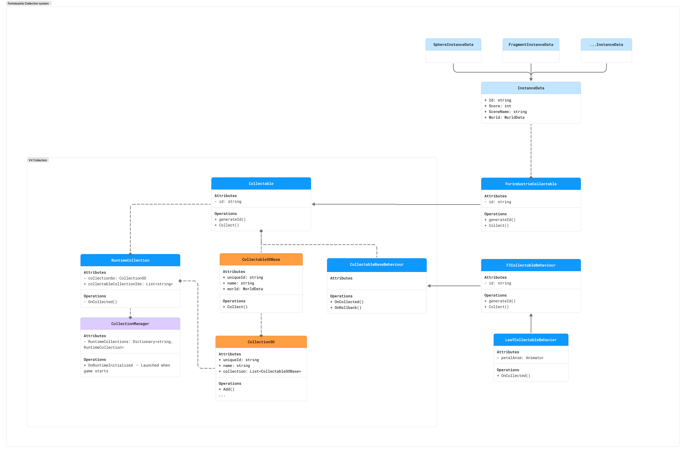
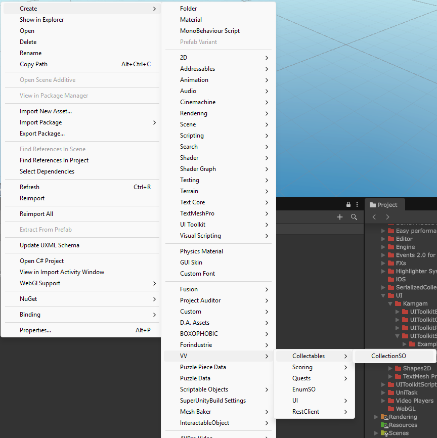
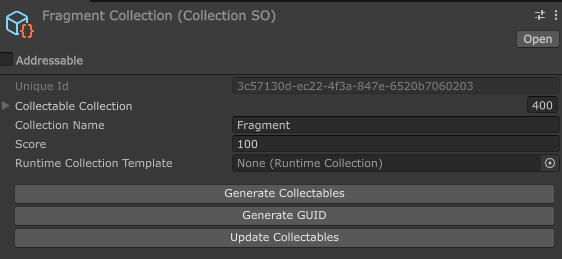
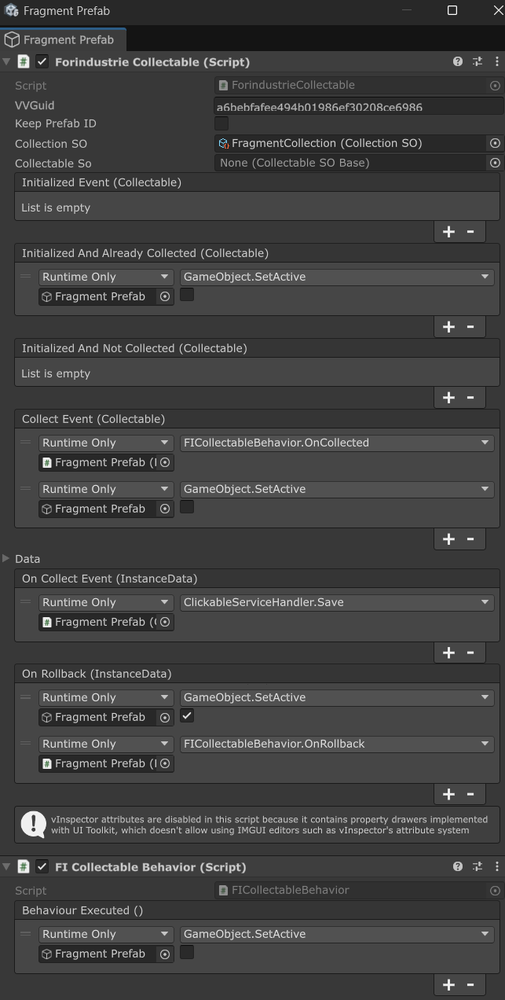
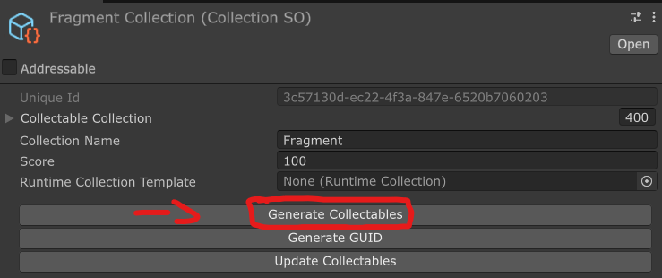
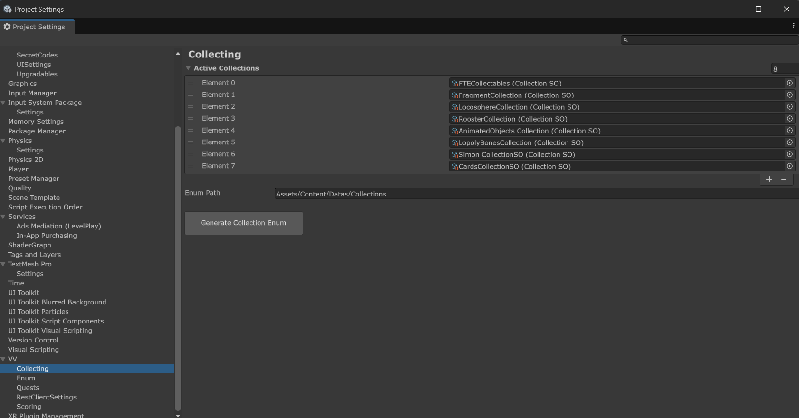

# 🛠 Collection System

## 🎯 Goals
> **Players**
> 
> Allow the players to collect any kind of objects.

> **Developers**
> 
> Allow developers to create objects to collect while being able to add and override any kind of behaviours.

## 🧩 Summary
- **Type**
  - Gameplay
- **Dependencies**
  - VInspector *Remove this dependency* *(only used in 'Collectable.cs' script)*
  - VV.Utility

## 🧱 Architecture
### [Diagram](https://www.figma.com/board/Dyb5c3L3XTcxIcthmgLzRg/Forindustrie-UML?node-id=283-691&t=d8oZ2a3GjXh3yJPl-0)

#### [VV Diagram](https://www.figma.com/board/Dyb5c3L3XTcxIcthmgLzRg/Forindustrie-UML?node-id=332-855&t=d8oZ2a3GjXh3yJPl-0)

#### [Forindustrie Diagram](https://www.figma.com/board/Dyb5c3L3XTcxIcthmgLzRg/Forindustrie-UML?node-id=283-691&t=d8oZ2a3GjXh3yJPl-0)

### Script Structure

    Scripts
    ├── Collectables
        ├── Editor
            ├── CollectionBuilder.cs
        ├── Data
            ├── CollectableSOBase.cs
            ├── CollectableStoredData.cs
            ├── CollectionSO.cs
        ├── Settings
            ├── CollectionsSettings.cs
            ├── CollectionsSettingsProvider.cs
        ├── Network
            ├── CollectablePayloadHandler.cs
            ├── CollectableSocketController.cs
            ├── CollectableSocketHandler.cs
        ├── Handler
            ├── CollectionEventHandler.cs
            ├── CollectionStatsHandler.cs
        ├── Collectable.cs
        ├── CollectableBaseBehaviour.cs
        ├── CollectionManager.cs
        ├── FICollectableBehaviour.cs
        ├── ForindustrieCollectable.cs
        ├── LeafCollectableBehaviour.cs
        └── RuntimeCollection.cs

## ⚙️ Internal 
### Internal Workflow

#### Collect Workflow

## 🔧 Unity Configuration
1. Create a Collection SO

2. Configure the name and score, you can add a template if needed

3. Configure the prefab\
You need at least to add the Collectable and Collectable behaviour components

4. Place the collectables in your game

5. Generate the collectables

6. In the Project Settings > VV > Collecting
Add the collection SO to the list and generate the enum (if the collection is new)

## 🔗 Dependancies
- VInspector *Remove this dependency* *(only used in 'Collectable.cs' script)*
- VV.Utility

## 🧪 Tests
> - [ ] Implement tests
> - **Unitaire**
> - **Integration**
>   - [ ] Test the collectable SO generation
> - **Gameplay**

## 🚀 Limits & Optimisations

No limits reached yet.

## 📌 Notes
Events are messy

